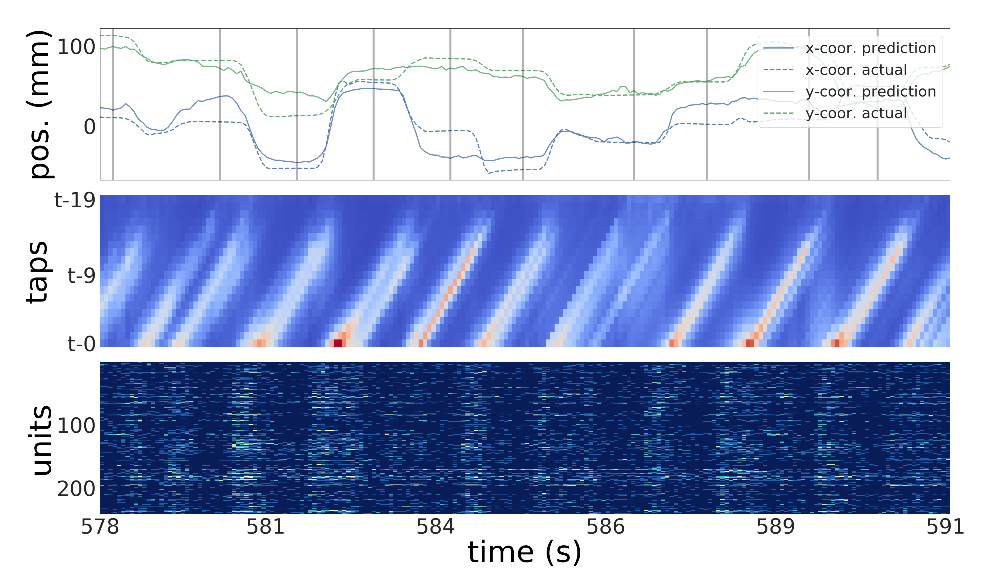
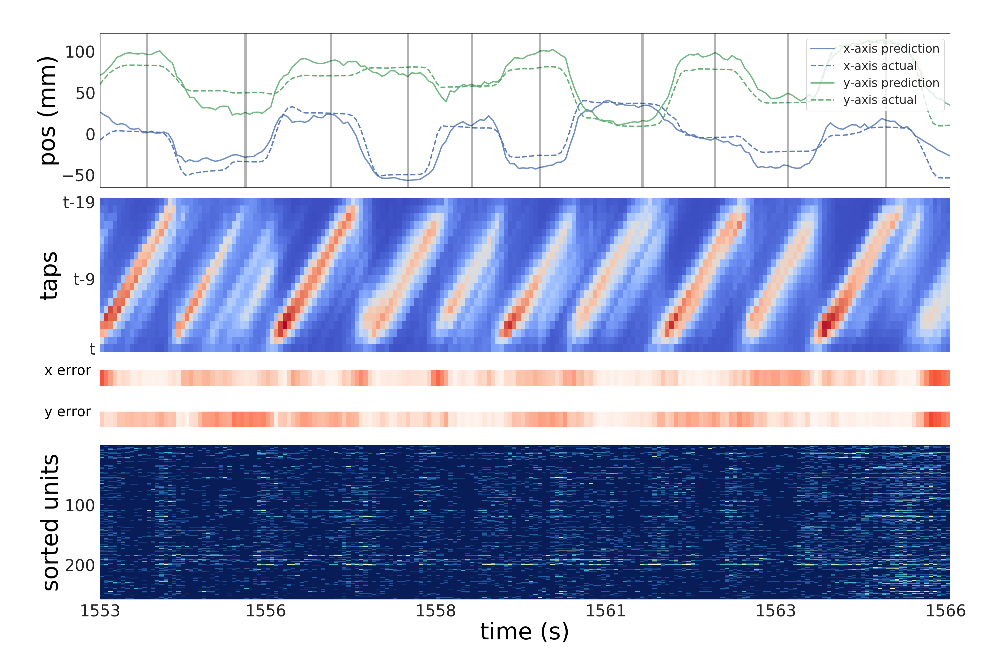

* 🔗DOI: https://doi.org/10.6844/NCKU202100120

* 🔗 [Thesis link](https://thesis.lib.ncku.edu.tw/thesis/detail/bbfc9ed1141389eeb2dd45be4da43203/) in NCKU library
	- 📥📄 e-paper full-text download
	- ```https://thesis.lib.ncku.edu.tw/thesis/detail/bbfc9ed1141389eeb2dd45be4da43203/```  
* 🔗 [Thesis link](https://hdl.handle.net/11296/t87h67) in National Digital Library of Theses and Dissertations in Taiwan
	- ```https://hdl.handle.net/11296/t87h67```  


## 	:sparkles: Thesis Highlight	:sparkles:
To assist individuals with motor disabilities, invasive Brain-Computer Interfaces (BCIs) decode neural spike signals into limb movements, but traditional linear filters and "black-box" deep learning models face limitations in accuracy and interpretability. To address this, we developed a novel neural decoder utilizing a two-layer bidirectional Gated Recurrent Unit (GRU) enhanced with layer normalization and a temporal self-attention module to predict nonhuman primate hand kinematics (position, velocity, and acceleration). The results demonstrated that this proposed architecture outperformed state-of-the-art methods, achieving higher weighted average $R^{2}$ across all six kinematic variables (x and y coordinates), with particularly significant improvements in decoding acceleration. Ultimately, the study concludes that while the bidirectional GRU and layer normalization primarily drive the accuracy improvements, the temporal attention module successfully provides an analytical, biologically plausible visualization of the neural decoding process, effectively bridging deep learning with neuroscience.


### Figure 4.11 from page 52
session indy_20160916_01      |  session indy_20161025_04  
:----------------------------:|:----------------------------:
   |     

<sub><sub><sub> [./Thesis_Wu/Visualization_of_attention_process_figures/indy_20160916_01/pos_attention_map_200_to_400.png](./Thesis_Wu/Visualization_of_attention_process_figures/indy_20160916_01/pos_attention_map_200_to_400.png) </sub></sub></sub> 
<sub><sub><sub> [./Thesis_Wu/Visualization_of_attention_process_figures/indy_20161025_04/pos_attention_map_400_to_600.png](./Thesis_Wu/Visualization_of_attention_process_figures/indy_20161025_04/pos_attention_map_400_to_600.png) </sub></sub></sub>


The novelty of Figure 4.11 lies in its ability to visually map the neural decoder's attention process directly to physical movements, specifically for decoding fingertip position. It reveals a distinct visual pattern—forming an "oblique line"—which demonstrates that the model's focus gradually shifts when the subject's fingertip stops moving.

This visualization is particularly novel because it provides an interpretable link between the artificial intelligence model and actual biological behavior. It visually confirms the neuroscientific theory that primary motor cortex (M1) neuronal responses primarily reflect the timing of a movement rather than the specific type of movement. Furthermore, it illustrates why the decoder cannot effectively rely on spiking activities that occur when the fingertip is completely stationary to predict trajectories, as M1 neuronal activities are not tied to standstill states.


## Table of contents
- [Spike_Analysis](#Spike-Analysis)  <br>
    - [Test](#Test-123-456)  <br>
    - [Electrodes](#Electrodes) <br>
	- [Makin et al 2018 results](#Makin-et-al-2018-results) <br>
		-[time bin 64 ms](#time-bin-64-ms) <br>
		- [indy](#indy) <br>
			- [R-square](#R-square-indy) <br>
			- [SNR](#SNR-indy) <br>
		- [loco](#loco) <br>
			- [R-square](#R-square-loco) <br>
			- [SNR](#SNR-loco) <br>
		- [Makin2018 result](#Makin2018-result)<br>
    - [Plots](#plots)<br>
        - [Spike Train](#Spike-Train)<br> 
        - [Trajectory of finger tip](#Trajectory-of-finger-tip)<br>
        - [Velocity in each axis](#Velocity-in-each-axis)<br>

<small><i><a href='http://ecotrust-canada.github.io/markdown-toc/'>Table of contents generated with markdown-toc</a></i></small>


# Spike Analysis
## Dataset 1
* Spikes are signals generated from the single frequency and have magnitude significantly larger than noise, the voltage drop from neural soma and axon membrane. Spike train is time-series data which comes from a neuron. In this repository I use the mat file "indy_20160407_02.mat" downloaded from [Nonhuman Primate Reaching with Multichannel Sensorimotor Cortex Electrophysiology](https://zenodo.org/record/583331#.XWirEigzZPb). This dataset has 96 channels and each channel contains 1-6 units. 
## Dataset 2
* Second dataset from article [A cryptography-based approach for movement decoding](https://www.biorxiv.org/content/10.1101/080861v1) and its github repository [Distribution Alignment Decoder (DAD)](https://github.com/KordingLab/DAD/tree/master/data). Download from [Dropbox](https://www.dropbox.com/s/nrgnte5m34xb18n/DAD-data-10-21-2017.zip?dl=0) or [Kording DAD](http://kordinglab.com/DAD/). 
* Contact: Eva.L.Dyer@gmail.com
## Cheat sheet
* ```find . -name "testset*" -type f -delete | find . -name "trainset*" -type f -delete```
* ```scatter(target_pos(:,1),target_pos(:,2), 'filled'); xlabel('mm'); ylabel('mm');ax=gca;ax.FontSize = 10;```

## Electrodes
Indy M1 

|          |          |         |         |       |         |        |        |        |        |
|----------|----------|---------|---------|-------|---------|--------|--------|--------|--------|
|     NaN  |    42    |   46    |  25     |  31   |   35    |  39    |  41    |  47    |  NaN   |
|     38   |    40    |  48     |  27     | 29    |   33    |  37    |  43    |   6    |   45   |
|     34   |    36    |  44     |   1     |   9   |    13   |   17   |   21   |    2   |    88  |
|     30   |    32    |  89     |  93     |  5    |   15    |  19    |  23    |   8    |   84   |
|     26   |    28    |  81     |  85     | 87    |   91    |   7    |   4    |   86   |   80   |
|     22   |    24    |  77     |  79     | 83    |    3    |  11    |  66    |  82    |   76   |
|     18   |    20    |  73     |  75     | 95    |   54    |  62    |  74    |  78    |  72    |
|     14   |    16    |  94     |  96     | 57    |   58    |  50    |  70    |  64    |  68    |
|     10   |    12    |  90     |  92     | 61    |   65    |  69    |  71    |  56    |  60    |
|     NaN  |    51    |   49    |  53     |  55   |   59    |  63    |  67    |  52    |  NaN   |

Indy S1 

|           |         |        |        |        |        |        |        |         |        |
|-----------|---------|--------|--------|--------|--------|--------|--------|---------|--------|
|     38    |  42     |  46    |  25    | NaN    |  35    |   39   |   41   |   47    |  45    |
|     NaN   |   40    |  48    |   27   |   29   |   33   |    37  |    43  |     6   |   NaN  |
|     34    |  36     |  44    |   1    |    9   |    13  |    17  |    21  |     2   |    88  |
|     30    |  32     |  89    |  93    |   5    |   15   |    19  |    23  |     8   |    84  |
|     26    |  28     |  81    |  85    |  87    |   91   |    7   |     4  |    86   |    80  |
|     22    |  24     |  77    |  79    |  83    |    3   |    11  |    66  |    82   |   76   |
|     18    |  20     |  73    |  75    |  95    |   54   |   62   |   74   |   78    |   72   |
|     14    |  16     |  94    |  96    |  57    |   58   |   50   |   70   |   64    |   68   |
|     10    |  12     |  90    |  92    |  61    |   65   |   69   |   71   |   56    |   60   |
|     NaN   |   51    |  49    |   53   |   55   |   59   |    63  |    67  |    52   |   31   |

Loco M1 and S1 

|          |          |         |         |       |         |        |        |        |        |
|----------|----------|---------|---------|-------|---------|--------|--------|--------|--------|
|     NaN  |    42    |   46    |  25     |  31   |   35    |  39    |  41    |  47    |  NaN   |
|     38   |    40    |  48     |  27     | 29    |   33    |  37    |  43    |   6    |   45   |
|     34   |    36    |  44     |   1     |   9   |    13   |   17   |   21   |    2   |    88  |
|     30   |    32    |  89     |  93     |  5    |   15    |  19    |  23    |   8    |   84   |
|     26   |    28    |  81     |  85     | 87    |   91    |   7    |   4    |   86   |   80   |
|     22   |    24    |  77     |  79     | 83    |    3    |  11    |  66    |  82    |   76   |
|     18   |    20    |  73     |  75     | 95    |   54    |  62    |  74    |  78    |  72    |
|     14   |    16    |  94     |  96     | 57    |   58    |  50    |  70    |  64    |  68    |
|     10   |    12    |  90     |  92     | 61    |   65    |  69    |  71    |  56    |  60    |
|     NaN  |    51    |   49    |  53     |  55   |   59    |  63    |  67    |  52    |  NaN   |

## Makin et al 2018 results
### time bin 64 ms
#### indy
##### R-square-indy
| Sessions | x pos | y pos | x vel | y vel | x acc | y acc |
| -------- | ----- | ----- | ----- | ----- | ----- | ----- |
|	indy_20160407_02	|	0.721931408	|	0.777293148	|	0.762777642	|	0.778829658	|	0.388751422	|	0.385790641	|
|	indy_20160411_01	|	0.84332939	|	0.863340897	|	0.776099521	|	0.834160719	|	0.429979217	|	0.435541619	|
|	indy_20160411_02	|	0.816997116	|	0.842269334	|	0.787879147	|	0.814974024	|	0.469928295	|	0.43601995	|
|	indy_20160418_01	|	0.794094073	|	0.837721577	|	0.789958515	|	0.827436585	|	0.471399872	|	0.446373015	|
|	indy_20160419_01	|	0.618568458	|	0.730723575	|	0.81938357	|	0.763168944	|	0.503725748	|	0.408822232	|
|	indy_20160420_01	|	0.677345933	|	0.707864342	|	0.747025201	|	0.802895684	|	0.488134095	|	0.485009209	|
|	indy_20160426_01	|	0.113926585	|	0.806842383	|	0.804509082	|	0.816971846	|	0.531655949	|	0.410534853	|
|	indy_20160622_01	|	0.58644447	|	0.565191407	|	0.56962925	|	0.502866397	|	0.238429588	|	0.138347945	|
|	indy_20160624_03	|	0.243014631	|	0.71211853	|	0.657538391	|	0.730737241	|	0.303393273	|	0.348747013	|
|	indy_20160627_01	|	0.596305766	|	0.698217963	|	0.612022584	|	0.792036047	|	0.321874956	|	0.443770864	|
|	indy_20160630_01	|	0.078520995	|	0.681129287	|	0.495082275	|	0.705549986	|	0.187969564	|	0.318576429	|
|	indy_20160915_01	|	0.710020103	|	0.856775393	|	0.674449286	|	0.780953133	|	0.333697481	|	0.470678264	|
|	indy_20160916_01	|	0.798309876	|	0.849221714	|	0.752492649	|	0.825975959	|	0.445173858	|	0.546593471	|
|	indy_20160921_01	|	0.775371121	|	0.869392375	|	0.753577361	|	0.853644789	|	0.477541699	|	0.614171711	|
|	indy_20160927_04	|	0.73185263	|	0.895933113	|	0.672495285	|	0.844464564	|	0.413324527	|	0.61155692	|
|	indy_20160927_06	|	0.596393841	|	0.747485331	|	0.670497022	|	0.771134754	|	0.431216961	|	0.547221985	|
|	indy_20160930_02	|	0.749764728	|	0.740063861	|	0.663981113	|	0.733426097	|	0.395631708	|	0.467013267	|
|	indy_20160930_05	|	0.739017396	|	0.83174522	|	0.63812166	|	0.764894164	|	0.355009818	|	0.4626449	|
|	indy_20161005_06	|	0.704870612	|	0.812429797	|	0.662506541	|	0.778542257	|	0.341583183	|	0.511763108	|
|	indy_20161006_02	|	0.653311894	|	0.81133429	|	0.701165473	|	0.806201745	|	0.434917898	|	0.50822405	|
|	indy_20161007_02	|	0.766134831	|	0.842295776	|	0.698875301	|	0.781284919	|	0.415414936	|	0.457522004	|
|	indy_20161011_03	|	0.649058328	|	0.77760421	|	0.660393642	|	0.719165	|	0.390714574	|	0.454808239	|
|	indy_20161013_03	|	0.729144832	|	0.844624812	|	0.707099752	|	0.772648465	|	0.466448285	|	0.525881172	|
|	indy_20161014_04	|	0.751982055	|	0.795604117	|	0.709345691	|	0.789860644	|	0.409654433	|	0.480408988	|
|	indy_20161017_02	|	0.693597407	|	0.815187217	|	0.699984794	|	0.790207154	|	0.500886193	|	0.548727026	|
|	indy_20161024_03	|	0.792966835	|	0.838694163	|	0.747232321	|	0.807434932	|	0.451642458	|	0.554604489	|
|	indy_20161025_04	|	0.716813517	|	0.846597347	|	0.723532927	|	0.788839215	|	0.460092592	|	0.532351008	|
|	indy_20161026_03	|	0.625450501	|	0.806558759	|	0.737640933	|	0.806284243	|	0.487307422	|	0.561748482	|
|	indy_20161027_03	|	0.4182186	|	0.721225733	|	0.660113154	|	0.747644083	|	0.373204839	|	0.460841516	|
|	indy_20161206_02	|	0.461938478	|	0.602403099	|	0.426274413	|	0.546080361	|	0.158943164	|	0.286587559	|
|	indy_20161207_02	|	0.679070709	|	0.818132182	|	0.707663812	|	0.82389297	|	0.450081394	|	0.576104901	|
|	indy_20161212_02	|	0.783425124	|	0.86893192	|	0.727457921	|	0.83871638	|	0.465665216	|	0.621272465	|
|	indy_20161220_02	|	0.565979958	|	0.780304989	|	0.498291292	|	0.717880093	|	0.269401569	|	0.475179042	|
|	indy_20170123_02	|	0.787826633	|	0.835476769	|	0.744152387	|	0.789492786	|	0.462853532	|	0.52515123	|
|	indy_20170124_01	|	0.765996043	|	0.855948588	|	0.773479119	|	0.829071932	|	0.509050435	|	0.564458186	|
|	indy_20170127_03	|	0.709138657	|	0.709907583	|	0.723720207	|	0.711341005	|	0.510454501	|	0.5035804	|
|	indy_20170131_02	|	0.59516855	|	0.648422427	|	0.63100909	|	0.701856915	|	0.377432825	|	0.419055428	|

##### SNR-indy
| Sessions | x pos | y pos | x vel | y vel | x acc | y acc |
| -------- | ----- | ----- | ----- | ----- | ----- | ----- |
|	indy_20160407_02	|	5.558480618	|	6.522664214	|	6.248443817	|	6.552731098	|	2.13782138	|	2.116835706	|
|	indy_20160411_01	|	8.05012466	|	8.643614329	|	6.499449778	|	7.803125939	|	2.441093098	|	2.483680743	|
|	indy_20160411_02	|	7.375420664	|	8.020838627	|	6.734166358	|	7.327672971	|	2.75665378	|	2.487362585	|
|	indy_20160418_01	|	6.863311523	|	7.897392208	|	6.776949197	|	7.63051272	|	2.768727359	|	2.567827495	|
|	indy_20160419_01	|	4.185833961	|	5.698016666	|	7.432427462	|	6.255613494	|	3.042782563	|	2.282819062	|
|	indy_20160420_01	|	4.91262856	|	5.344154307	|	5.969227412	|	7.053038657	|	2.908437977	|	2.882005366	|
|	indy_20160426_01	|	0.525302936	|	7.140881613	|	7.088734129	|	7.374821005	|	3.294349921	|	2.29541868	|
|	indy_20160622_01	|	3.834661672	|	3.617018816	|	3.661572529	|	3.035268801	|	1.182899373	|	0.64668072	|
|	indy_20160624_03	|	1.209125146	|	5.407862876	|	4.653881072	|	5.698237093	|	1.570123361	|	1.862502716	|
|	indy_20160627_01	|	3.939474532	|	5.20306615	|	4.111935534	|	6.82011935	|	1.686902164	|	2.547462656	|
|	indy_20160630_01	|	0.355145551	|	4.963853665	|	2.967793836	|	5.309884213	|	0.904276926	|	1.665828481	|
|	indy_20160915_01	|	5.376321084	|	8.439823617	|	4.873813481	|	6.59462955	|	1.763285449	|	2.762802719	|
|	indy_20160916_01	|	6.953153665	|	8.216611979	|	6.064118977	|	7.593907521	|	2.55843084	|	3.435122307	|
|	indy_20160921_01	|	6.485344109	|	8.84031467	|	6.083193964	|	8.345918085	|	2.819483659	|	4.13605933	|
|	indy_20160927_04	|	5.716264578	|	9.826874381	|	4.847824432	|	8.0817065	|	2.316020679	|	4.106726112	|
|	indy_20160927_06	|	3.940422155	|	5.977133874	|	4.821406557	|	6.404201515	|	2.450533628	|	3.441146686	|
|	indy_20160930_02	|	6.016514739	|	5.851333359	|	4.736363114	|	5.741823698	|	2.186983285	|	2.732836014	|
|	indy_20160930_05	|	5.8338844	|	7.740325891	|	4.414374104	|	6.287365894	|	1.904468962	|	2.697386252	|
|	indy_20161005_06	|	5.299875423	|	7.268361524	|	4.717346394	|	6.547091308	|	1.81499085	|	3.11369408	|
|	indy_20161006_02	|	4.600610581	|	7.24307025	|	5.245692263	|	7.12650137	|	2.478884479	|	3.082327137	|
|	indy_20161007_02	|	6.310344559	|	8.021566745	|	5.212536207	|	6.601212704	|	2.331522846	|	2.656178727	|
|	indy_20161011_03	|	4.547650596	|	6.528734382	|	4.690241875	|	5.515487675	|	2.151792101	|	2.634507156	|
|	indy_20161013_03	|	5.672628742	|	8.086183319	|	5.332802603	|	6.433021087	|	2.728234801	|	3.241127982	|
|	indy_20161014_04	|	6.055168956	|	6.895278562	|	5.366232338	|	6.77492603	|	2.288936938	|	2.843383698	|
|	indy_20161017_02	|	5.137075637	|	7.332679921	|	5.228567335	|	6.782093258	|	3.01800416	|	3.45560675	|
|	indy_20161024_03	|	6.839600781	|	7.92349916	|	5.972784598	|	7.154224919	|	2.609361788	|	3.51254164	|
|	indy_20161025_04	|	5.479274807	|	8.141671301	|	5.583565856	|	6.753867317	|	2.676807135	|	3.300799978	|
|	indy_20161026_03	|	4.264907796	|	7.134509295	|	5.811039218	|	7.128350513	|	2.901429694	|	3.582765709	|
|	indy_20161027_03	|	2.352401676	|	5.547473181	|	4.686656429	|	5.979865077	|	2.028743651	|	2.682835565	|
|	indy_20161206_02	|	2.691680644	|	4.005570095	|	2.412957812	|	3.430210265	|	0.751746547	|	1.466593217	|
|	indy_20161207_02	|	4.935906431	|	7.402441429	|	5.341174204	|	7.542233068	|	2.597015864	|	3.727416048	|
|	indy_20161212_02	|	6.643919257	|	8.825030629	|	5.645664357	|	7.924097387	|	2.721865536	|	4.216731186	|
|	indy_20161220_02	|	3.624902152	|	6.581798058	|	2.995483606	|	5.495662673	|	1.363212647	|	2.799888304	|
|	indy_20170123_02	|	6.733091326	|	7.83772769	|	5.920186312	|	6.767330169	|	2.699072758	|	3.234446825	|
|	indy_20170124_01	|	6.307767983	|	8.414824797	|	6.448917585	|	7.671866153	|	3.089631207	|	3.609701447	|
|	indy_20170127_03	|	5.363139954	|	5.374636235	|	5.586508786	|	5.39614905	|	3.102069379	|	3.0415108	|
|	indy_20170131_02	|	3.927257557	|	4.53978836	|	4.329843324	|	5.25575259	|	2.058137813	|	2.358653015	|


#### loco
##### R-square-loco
| Sessions | x pos | y pos | x vel | y vel | x acc | y acc |
| -------- | ----- | ----- | ----- | ----- | ----- | ----- |
|	loco_20170210_03	|	0.025797513	|	0.666415476	|	0.361813447	|	0.695921041	|	0.064998661	|	0.34137872	|
|	loco_20170213_02	|	0.188121018	|	0.393606998	|	0.493476246	|	0.710163913	|	0.204823076	|	0.333748386	|
|	loco_20170214_02	|	0.114867166	|	0.638551675	|	0.314464245	|	0.723387759	|	0.069393112	|	0.366147421	|
|	loco_20170215_02	|	-0.463	|	0.6582	|	0.2056	|	0.7022	|	-0.0202	|	0.3573	|
|	loco_20170216_02	|	0.231321658	|	0.728803858	|	0.277786426	|	0.707420388	|	0.010764721	|	0.390536781	|
|	loco_20170217_02	|	-0.004043074	|	0.719651259	|	0.433395914	|	0.842334858	|	0.175599681	|	0.531097629	|
|	loco_20170227_04	|	0.464082769	|	0.726695536	|	0.500310379	|	0.782911421	|	0.155600143	|	0.455954698	|
|	loco_20170228_02	|	0.440677574	|	0.726035623	|	0.440811363	|	0.794094439	|	0.115533464	|	0.513351124	|
|	loco_20170301_05	|	0.242092803	|	0.734568695	|	0.536636379	|	0.769063879	|	0.232559589	|	0.488497022	|
|	loco_20170302_02	|	0.403232832	|	0.583677789	|	0.278599195	|	0.660988359	|	0.005183478	|	0.292558606	|

##### SNR-loco
| Sessions | x pos | y pos | x vel | y vel | x acc | y acc |
| -------- | ----- | ----- | ----- | ----- | ----- | ----- |
|	loco_20170210_03	|	0.113507661	|	4.767941054	|	1.95052351	|	5.1701363	|	0.291877671	|	1.813642414	|
|	loco_20170213_02	|	0.905087017	|	2.17245819	|	2.954001829	|	5.378475422	|	0.995362316	|	1.763617262	|
|	loco_20170214_02	|	0.529915488	|	4.419537839	|	1.639698891	|	5.581286054	|	0.312337373	|	1.98011738	|
|	loco_20170215_02	|	-1.652443261	|	4.662279416	|	0.999607645	|	5.260753066	|	-0.086853192	|	1.919917001	|
|	loco_20170216_02	|	1.142553555	|	5.667164933	|	1.413343533	|	5.337559403	|	0.04700404	|	2.150524987	|
|	loco_20170217_02	|	-0.017523448	|	5.523013896	|	2.467202982	|	8.02264313	|	0.838618489	|	3.289175714	|
|	loco_20170227_04	|	2.709022791	|	5.633532741	|	3.012996709	|	6.633630249	|	0.734518487	|	2.643649357	|
|	loco_20170228_02	|	2.523377669	|	5.623059046	|	2.524416623	|	6.863319234	|	0.53318594	|	3.127842754	|
|	loco_20170301_05	|	1.203839692	|	5.760478572	|	3.34078066	|	6.365081325	|	1.149553361	|	2.911518334	|
|	loco_20170302_02	|	2.241950779	|	3.805704185	|	1.418233773	|	4.697853887	|	0.022570107	|	1.503095324	|

### Makin2018 result
| session          | time bins | units |
|------------------|-----------|-------|
| indy_20160407_02 | 7777      | 291   |
| indy_20160411_01 | 9894      | 320   |
| indy_20160411_02 | 8749      | 321   |
| indy_20160418_01 | 16212     | 361   |
| indy_20160419_01 | 3187      | 413   |
| indy_20160420_01 | 19268     | 383   |
| indy_20160426_01 | 22532     | 413   |
| indy_20160622_01 | 33276     | 248   |
| indy_20160624_03 | 2812      | 240   |
| indy_20160627_01 | 47546     | 245   |
| indy_20160630_01 | 17863     | 171   |
| indy_20160915_01 | 953       | 222   |
| indy_20160916_01 | 2059      | 217   |
| indy_20160921_01 | 627       | 220   |
| indy_20160927_04 | 1083      | 208   |
| indy_20160927_06 | 1578      | 207   |
| indy_20160930_02 | 2199      | 210   |
| indy_20160930_05 | 1343      | 204   |
| indy_20161005_06 | 843       | 189   |
| indy_20161006_02 | 2843      | 213   |
| indy_20161007_02 | 2677      | 214   |
| indy_20161011_03 | 5527      | 227   |
| indy_20161013_03 | 3085      | 189   |
| indy_20161014_04 | 3109      | 232   |
| indy_20161017_02 | 2747      | 202   |
| indy_20161024_03 | 2380      | 198   |
| indy_20161025_04 | 2875      | 224   |
| indy_20161026_03 | 2772      | 199   |
| indy_20161027_03 | 4046      | 213   |
| indy_20161206_02 | 6529      | 195   |
| indy_20161207_02 | 1954      | 199   |
| indy_20161212_02 | 3761      | 180   |
| indy_20161220_02 | 4005      | 178   |
| indy_20170123_02 | 4527      | 190   |
| indy_20170124_01 | 4218      | 214   |
| indy_20170127_03 | 6461      | 208   |
| indy_20170131_02 | 7749      | 213   |
| loco_20170210_03 | 2500      | 418   |
| loco_20170213_02 | 26200     | 450   |
| loco_20170214_02 | 5859      | 447   |
| loco_20170215_02 | 12090     | 437   |
| loco_20170216_02 | 7031      | 416   |
| loco_20170217_02 | 5979      | 470   |
| loco_20170227_04 | 25703     | 507   |
| loco_20170228_02 | 15078     | 523   |
| loco_20170301_05 | 4218      | 507   |
| loco_20170302_02 | 17656     | 500   |

## Plots
### Spike Train

* Spike trains from channel 14 for instance, has data from unit 1 to unit 3, ploted in different color.
---
### Trajectory of finger tip
      
* The trajectory of fingertips with all 204,446 data points.
---
### Velocity in each axis
   
* The velocity of fingertips in three axis with all 204,446 data points.
---
