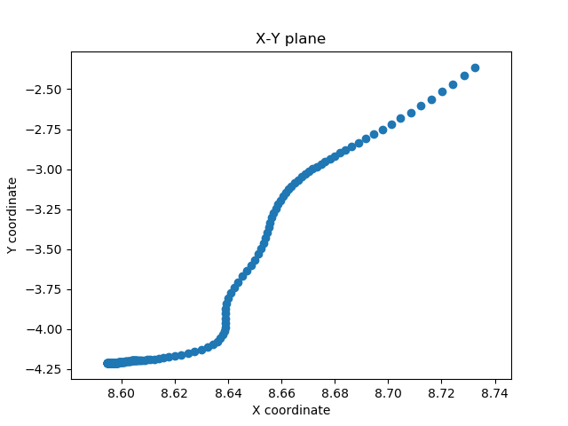

# Spike_Analysis
### Spikes are signals generated from the single frequency and have magnitude significantly larger than noise. Spike train is time-series data which comes from a neuron. In this repository I use the mat file "indy_20160407_02.mat" downloaded from [Nonhuman Primate Reaching with Multichannel Sensorimotor Cortex Electrophysiology](https://zenodo.org/record/583331#.XWirEigzZPb). This dataset has 96 channels and each channel contains 1-6 units.  

#### Spike trains from channel 14 for instance, has data from unit 1 to unit 3, ploted in different color
---
  
#### The trajectory of fingertips from 1000 data point
---